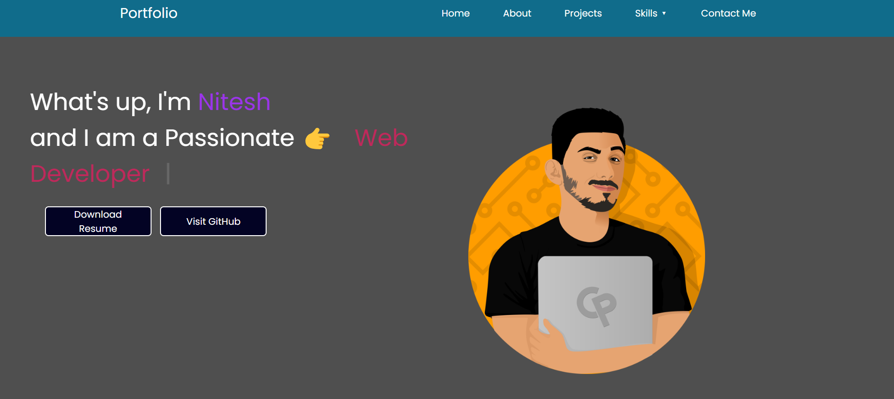
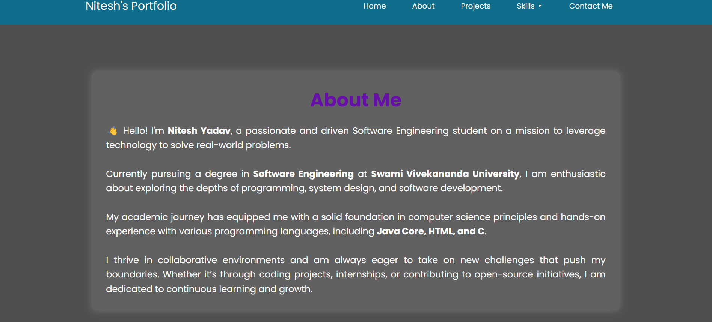
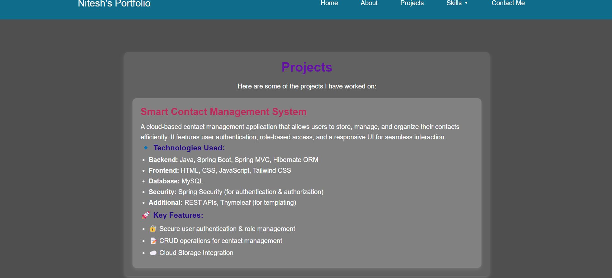
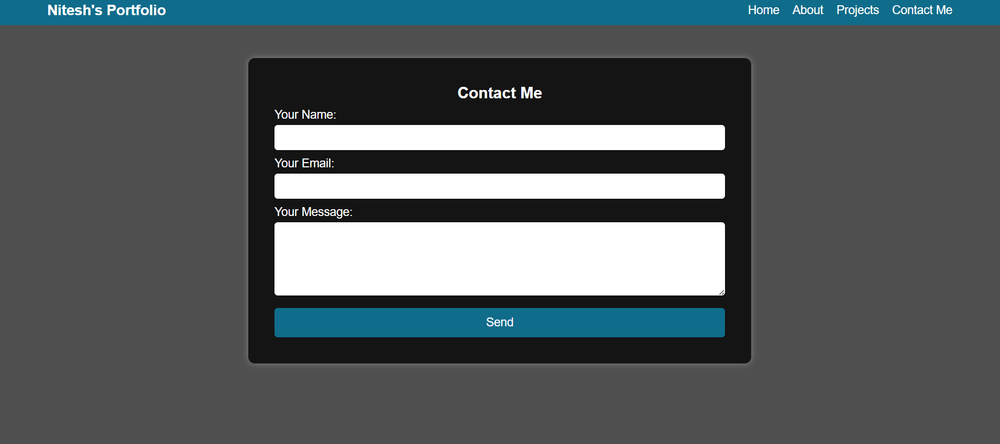
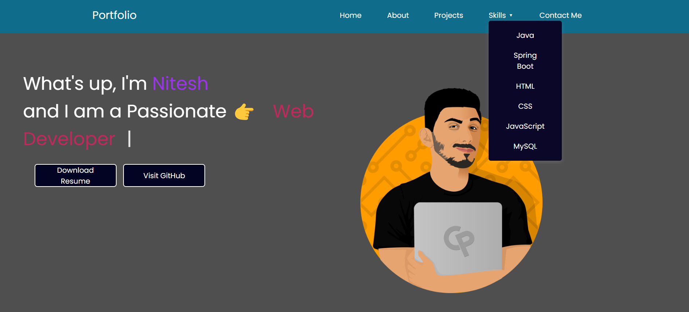

# Portfolio Website – Nitesh Yadav

This is my personal portfolio website showcasing my skills, projects, and experience.

## 🚀 Technologies Used

- HTML, CSS, JavaScript
- Tailwind CSS
- Typed.js for text animation

## 📸 Preview

Here are some screenshots of the website:

- [🏠 Home Page](#home-page)
- [📖 About Page](#about-page)
- [💼 Projects Page](#projects-page)
- [📩 Contact Page](#contact-page)
- [🛠️ Skills Page](#skills-page)

## Home Page
## 🏠 Home Page



## 📖 About Page



## 💼 Projects Page



## 📩 Contact Page



## 🛠️ Skills Page




## 📂 How to Use

Clone the repository:

```bash
git clone https://github.com/yadavnitesh07/MyPortfolio

